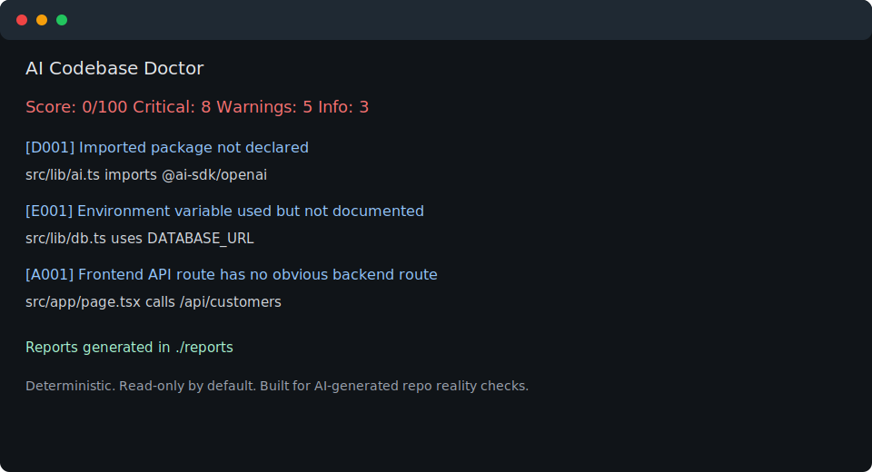

# AI Codebase Doctor

[](https://www.npmjs.com/package/ai-codebase-doctor)
[](https://www.npmjs.com/package/ai-codebase-doctor)
[](https://github.com/daqiu753-hash/ai-codebase-doctor/actions/workflows/ci.yml)
[](https://github.com/daqiu753-hash/ai-codebase-doctor/releases)
[](LICENSE)

AI can generate a repo in minutes.

But can it actually run?

`ai-codebase-doctor` audits AI-generated codebases for hallucinated dependencies, broken scripts, missing env vars, fake tests, and lying README instructions.

It is not a generic linter. It is a deterministic, read-only reality check for repos that look finished but may not install, configure, test, or start.

The scanner is best-effort and conservative by design: it favors concrete, explainable mismatches over broad static-analysis coverage.



```bash
npx ai-codebase-doctor .
```

Try it on the included broken AI-generated SaaS fixture:

```bash
npx ai-codebase-doctor examples/ai-generated-fake-saas --out reports
```

```text
Score: 0/100
Critical: 8
Warnings: 4
Info: 3

Reports generated in ./reports
```

## Installation

Run it directly with `npx`:

```bash
npx ai-codebase-doctor .
```

For local development in this repository:

```bash
npm install
npm run build
npm run doctor:example
```

To run the local build against this repository:

```bash
node dist/cli.js .
```

## Usage

Scan the current project:

```bash
npx ai-codebase-doctor .
```

Write reports to a custom directory:

```bash
npx ai-codebase-doctor ./path/to/project --out reports
```

Print JSON to stdout:

```bash
npx ai-codebase-doctor . --json --no-files
```

Use CI mode to fail a job when critical findings exist:

```bash
npx ai-codebase-doctor . --ci
```

Choose report output:

```bash
npx ai-codebase-doctor . --format all
npx ai-codebase-doctor . --format json
```

Choose failure policy:

```bash
npx ai-codebase-doctor . --fail-on critical
npx ai-codebase-doctor . --fail-on warning
npx ai-codebase-doctor . --fail-on none
```

Select a framework profile:

```bash
npx ai-codebase-doctor . --profile auto
npx ai-codebase-doctor . --profile nextjs
```

Opt into npm registry checks:

```bash
npx ai-codebase-doctor . --online
```

The scanner reads project files only by default. It does not execute target-project scripts and does not call an LLM API. Network checks only run when `--online` is explicitly passed.

## GitHub Actions

Add a read-only CI check:

```yaml
- uses: actions/setup-node@v4
  with:
    node-version: 20
- run: npx ai-codebase-doctor . --ci
```

For local development in this repository, use the local build:

```yaml
- run: npm ci
- run: npm run build
- run: node dist/cli.js . --ci
```

See [docs/ci.md](docs/ci.md) for `--fail-on` policies and offline/online guidance.

## Example output

```text
AI Codebase Doctor

Score: 21/100
Critical: 6
Warnings: 1
Info: 2

Detected:
- Framework: nextjs
- Package manager: npm
- Source files: 3
- Test files: 1

[D001] Imported package not declared
Severity: critical
File: src/lib/ai.ts
Line: 1
Evidence: src/lib/ai.ts imports @ai-sdk/openai
Fix: Install and declare @ai-sdk/openai, replace the import, or remove unused code.

[E001] Environment variable used but not documented
Severity: critical
File: src/lib/db.ts
Line: 2
Evidence: src/lib/db.ts uses DATABASE_URL
Fix: Add DATABASE_URL= to .env.example and document how to obtain it.

[R001] README command not found
Severity: critical
File: README.md
Line: 9
Evidence: README says: pnpm dev
Fix: Add a "dev" script to package.json or update the README command.
```

## Generated reports

By default, file output is written to `doctor-reports/`. In this repo, the example command writes to `reports/`, which is ignored by git.

Generated files:

| File | Purpose |
|---|---|
| `doctor-report.md` | Human-readable audit report that can be pasted into an issue. |
| `doctor-report.json` | Structured report for tooling and CI experiments. |
| `fix-with-codex.md` | Repair prompt for Codex. |
| `fix-with-claude-code.md` | Repair prompt for Claude Code. |
| `fix-with-cursor.md` | Repair prompt for Cursor. |

See also [docs/report-schema.md](docs/report-schema.md), [docs/ci.md](docs/ci.md), [docs/integrations.md](docs/integrations.md), [docs/demo.md](docs/demo.md), and [docs/field-test-report.md](docs/field-test-report.md).

## What it checks today

| ID | Area | Severity | Check |
|---|---|---:|---|
| `R001` | README | critical | README mentions a package script command that is missing from `package.json`. |
| `S002` | Scripts | critical | A `package.json` script references an entry file that does not exist. |
| `E001` | Env | critical | Source code uses an env var that is missing from `.env.example`. |
| `E002` | Env | info | `.env.example` documents an env var that source code does not use. |
| `D001` | Dependencies | critical | JS/TS source imports a package not declared in `package.json`. |
| `T001` | Tests | warning | A test file has no obvious assertion. |

Runtime checks also cover package manager mismatches, Node/Docker version drift, Docker command reality, Prisma/Drizzle setup claims, and opt-in npm registry existence checks. See [docs/checks.md](docs/checks.md).

Framework profiles add best-effort checks for Next.js, Vite, Express, and FastAPI. See [docs/profiles.md](docs/profiles.md).

## Why not just use ESLint/Semgrep/Gitleaks/Knip?

Use those tools too. `ai-codebase-doctor` checks a different layer: whether an AI-generated repository is internally honest about how to run.

| Tool | Best at | Different from `ai-codebase-doctor` |
|---|---|---|
| ESLint | Code quality and style rules. | Does not compare README commands, env docs, scripts, and generated tests as a run-readiness check. |
| Semgrep | Pattern-based static analysis and security rules. | Broader and more powerful, but not focused on AI repo reality mismatches. |
| Gitleaks | Secret detection. | Looks for leaked secrets, not missing env documentation or broken startup instructions. |
| Knip | Unused files, exports, and dependencies. | Helps remove dead code; this tool flags hallucinated dependencies and docs/scripts that lie. |

## What this is not

- Not a replacement for ESLint, TypeScript, tests, security scanners, or dependency audits.
- Not a full static analyzer.
- Not a full API contract verifier.
- Not an automatic repair tool.
- Not an LLM wrapper.
- Not a guarantee that the app is production-ready.

## Known limitations

See [docs/known-limitations.md](docs/known-limitations.md).

For scanner quality and false-positive handling, see [docs/scanner-quality.md](docs/scanner-quality.md) and [docs/false-positive-policy.md](docs/false-positive-policy.md).

## Roadmap

See [docs/roadmap.md](docs/roadmap.md).

Near-term focus:

- stronger Dockerfile and config consistency checks
- secret-lite checks without becoming a secret scanner
- frontend/backend API path mismatch detection
- better line-number evidence

## Launch Notes

Short launch copy is available in [docs/launch](docs/launch/).

## Philosophy

AI-generated repos often look complete before they are complete. This tool focuses on the boring but expensive gaps: commands that do not exist, files that scripts point to but never created, env vars nobody documented, imports nobody declared, and tests that verify nothing.

## License

MIT
